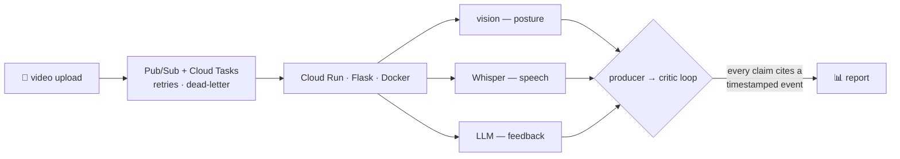

# Chia Zhi Feng 谢梓峰

  
  
  

I run engineering at **[pitchMe](https://www.pitchmesg.com)** — an AI public-speaking
coach running pilots across Singapore schools and community programmes. One video
of you speaking goes in; structured feedback on posture, delivery and speech comes
back in under a minute. S$71K raised without giving up a single share, 237 learners
coached so far, and a research programme with SUTD keeping the AI honest.

Most of my code lives in private repos — pitchMe is commercial IP, and my robotics
work belongs to [Singapore Polytechnic's RoboCup@Work team](https://zhifeng-portfolio.vercel.app/projects/robo-erectus).
So the public index of what I build is the portfolio: case studies with real
architecture, real numbers, and the parts that broke along the way.

**→ [zhifeng-portfolio.vercel.app](https://zhifeng-portfolio.vercel.app)** &nbsp;·&nbsp; [中文版](https://zhifeng-portfolio.vercel.app/?lang=zh)

## What I mean by "survives real users"

pitchMe's analysis pipeline, roughly:

The critic agent audits every piece of feedback before a learner sees it — no
cited behavioural event, no ship. That one loop cut hallucinated feedback from
34% to 16% in A/B evaluation, and the fan-out design took per-video analysis
from ~3 minutes to ~50 seconds.

## Selected builds

| | |
|---|---|
| 🎤 **[pitchMe](https://zhifeng-portfolio.vercel.app/projects/pitchme)** · private repo | Multi-agent LLM pipeline (Claude API, LangChain), GCP fan-out architecture, Stripe billing, security hardened with a CREST-certified pen tester over 3 retest cycles. |
| 🤖 **[Robo-Erectus](https://zhifeng-portfolio.vercel.app/projects/robo-erectus)** · team repo | C++/Qt ROS operator GUI that cut RoboCup@Work competition setup 51%, plus a Blender synthetic-data pipeline that pushed YOLOv8 detection to 87.2%. 2nd place, RoboCup France 2023 Technical Challenge. |
| 📊 **[DTP-MU-Project](https://github.com/Kopi-O-Kosong-Beng/DTP-MU-Project)** · public | What drives U.S. per-capita CO₂ emissions? 1,300-observation panel regressions, adjusted R² up to 0.98 — with honest out-of-sample validation where the models fall apart. |
| 🕹️ **[Math Me Home](https://zhifeng-portfolio.vercel.app/projects/math-me-home)** | A two-player math game with no CPU and no software — pure clocked FPGA hardware in Lucid HDL: 117-state FSM, custom ALU, laser-cut cabinet. |
| 🐦 **[Grow & Go](https://zhifeng-portfolio.vercel.app/projects/grow-and-go)** | Award-winning bird-deterrent food cover: hand-labeled CV dataset, ESP32 mesh over WiFi, Telegram alerts. |

## Tools I reach for

  

How I work: spec-first, with a multi-agent AI workflow (Claude Code · Codex · MCP).
The portfolio site is itself the exhibit — its `specs/` folder is committed in
the open, requirements → design → tasks.

---

**Always happy to talk shop** — multi-agent evals, robotics tooling, or why your
fan-out pipeline is slower than it should be. If you're building something
interesting, or you think I'd be a good fit for it, my inbox is open.

📫 zhifeng010729@gmail.com &nbsp;·&nbsp; [LinkedIn](https://www.linkedin.com/in/zhi-feng-chia-a50266210/)

*Yes, the username is a coffee order. Kopi o kosong — black, no sugar. The correct way.* ☕

