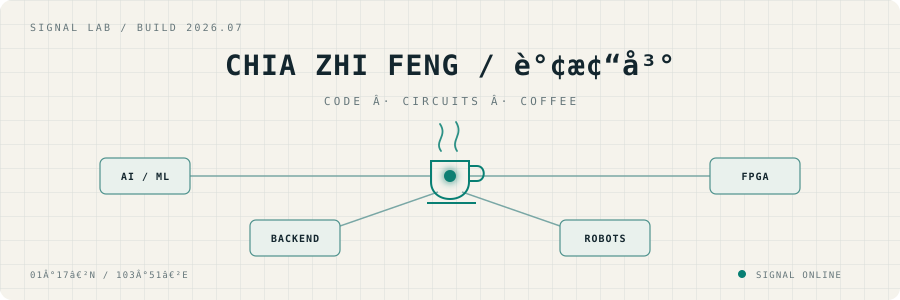

<picture>
  <source media="(prefers-color-scheme: dark)" srcset="./assets/signal-lab-dark.svg">
  <source media="(prefers-color-scheme: light)" srcset="./assets/signal-lab-light.svg">
  
</picture>

<p align="center">
  I study Computer Science and Design at SUTD. I like building things that connect software to the physical world.
</p>

<p align="center">
  <a href="https://zhifeng-portfolio.vercel.app/">Portfolio</a>
  &nbsp;·&nbsp;
  <a href="https://www.linkedin.com/in/zhi-feng-chia-a50266210/">LinkedIn</a>
  &nbsp;·&nbsp;
  <a href="mailto:zhifeng010729@gmail.com">Email</a>
</p>

<details>
<summary><code>brew --profile</code></summary>
<br>

```text
coffee      kopi o kosong
location    singapore
currently   studying at SUTD and tinkering
serious     zhifeng-portfolio.vercel.app
```

</details>

<details>
<summary><code>why the username?</code></summary>
<br>

Kopi o kosong beng is simply my coffee order: black coffee, no sugar, iced.

</details>
