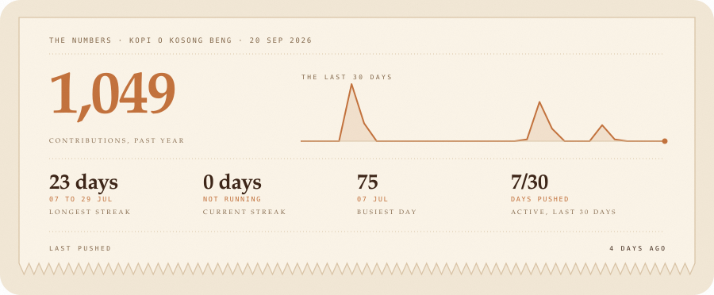

<picture>
  <source media="(prefers-color-scheme: dark)" srcset="./assets/kopi-sign-dark.svg">
  <source media="(prefers-color-scheme: light)" srcset="./assets/kopi-sign-light.svg">
  
</picture>

  <a href="./README.md" lang="en">English</a> &nbsp;&middot;&nbsp; 中文

我是谢梓峰,在 SUTD 读计算机科学与设计。我做的东西多半最后都要碰到实体世界,有意思的 bug 都藏在那里。

### 今日供应

**[pitchMe](https://www.pitchmesg.com)**,co-founder 兼 CTO。用 AI 教你讲话:你录一段自己说话的视频,它老实告诉你讲得怎么样。新加坡的一些学校和青年计划在用。

### 配菜

* 一只被我教会不把东西摔在地上的机械臂
* 一个双人数学游戏,里面没有 CPU,只有线和状态
* 无尘室里的量子元件,几点做的就不说了
* 一份很不听话的美国碳排放数据

### 杯里还有

* 跆拳道。比过赛。一开始打得很烂。
* 潜水。下面没有手机信号,这正是重点。
* 马拉松和爬山,主要是为了看风景
* 乒乓球至今不败(样本:我的朋友)

### 完整菜单

[作品集](https://zhifeng-portfolio.vercel.app/) &nbsp;&middot;&nbsp; [pitchMe](https://www.pitchmesg.com) &nbsp;&middot;&nbsp; [LinkedIn](https://www.linkedin.com/in/zhi-feng-chia-a50266210/) &nbsp;&middot;&nbsp; [打个招呼](mailto:zhifeng010729@gmail.com)

为什么叫 kopi o kosong beng?

 

这就是我每次点的。Kopi 是咖啡,o 是不加奶,kosong 是不加糖,beng 是加冰。合起来:冰咖啡乌,不甜。

对,上面招牌里那杯是有冰的。故意的。

最近在煮什么

 

还在 SUTD。八月底飞去 Waterloo 交换一个学期。现在主要在做自己的作品集网站,那是我唯一会好好把东西写下来的地方。

### 账单

<picture>
  <source media="(prefers-color-scheme: dark)" srcset="./assets/kopi-chit-dark.svg">
  <source media="(prefers-color-scheme: light)" srcset="./assets/kopi-chit-light.svg">
  
</picture>

<i>不要糖。从来都不要。</i>

